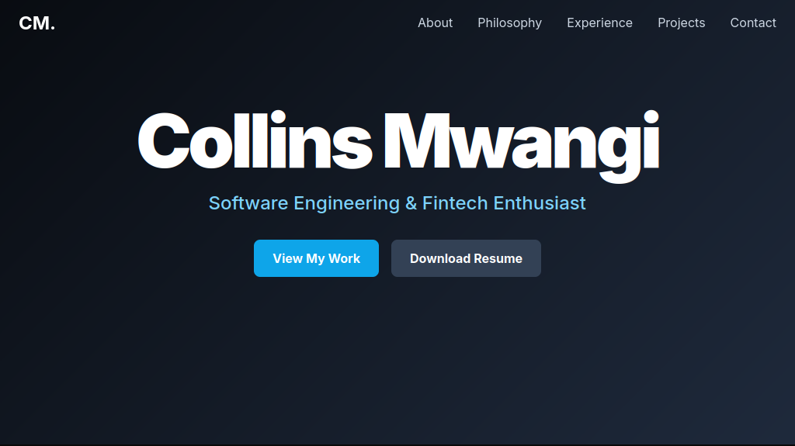

# Personal Portfolio Website

This is the repository for my personal portfolio website, built to showcase my skills, projects, and professional experience in software engineering and data science. The site is designed to be clean, modern, and fully responsive.

**Live Demo:** [https://collinsmwangi.up.railway.app/](https://collinsmwangi.up.railway.app/)

---

### ## Screenshot

 

---

### ## Tech Stack

-   **HTML5**
-   **Tailwind CSS** for the utility-first styling framework.
-   **PostCSS & Autoprefixer** for CSS processing and browser compatibility.
-   **JavaScript** for interactive elements like animations and the mobile menu.
-   **Serve** for serving the static files in a production environment.
-   **Lucide Icons** for clean, consistent iconography.

---

### ## Key Features

-   **Modern & Responsive Design:** A mobile-first approach ensures the site looks great on all devices.
-   **Interactive UI:** Smooth, scroll-based reveal animations and subtle hover effects create an engaging user experience.
-   **Locally Managed Tooling:** Uses a professional `npm` workflow to compile and purge Tailwind CSS for optimal performance.
-   **Accessibility & SEO Considered:** Implemented with semantic HTML, ARIA labels, and metadata for better accessibility and discoverability.

---

### ## How to Run Locally

1.  Clone the repository:
    ```bash
    git clone https://github.com/ny-collins/portfolio.git
    ```
2.  Navigate to the project directory:
    ```bash
    cd portfolio
    ```
3.  Install the necessary dependencies:
    ```bash
    npm install
    ```
4.  Run the Tailwind CSS build command in "watch" mode:
    ```bash
    npm run tailwind -- -i ./css/input.css -o ./css/style.css --watch
    ```
5.  Open the `index.html` file in your browser.

---

### ## Running Locally (Production Mode)

To preview the site exactly as it would appear when deployed, run the `start` script.
```bash
npm start
```
This will start a local web server, and you can view the site at the URL provided in your terminal (usually `http://localhost:3000`).

### ## Deployment

This project is configured for easy deployment on platforms like Railway. The platform will automatically detect the `start` script (`serve -s` .) in the package.json file and use it to launch the static web server after a successful build. No further configuration is needed.
